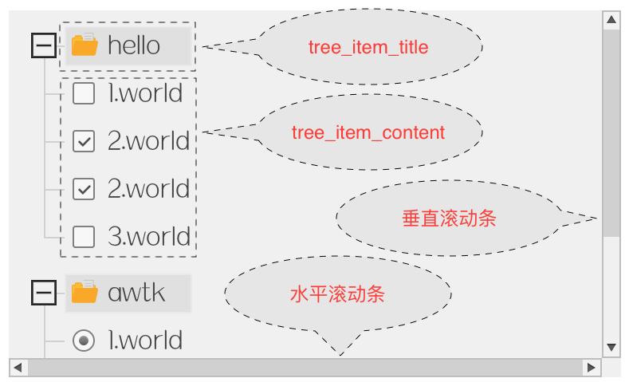

# 使用方法



## tree\_view 树形视图 

> 树形视图由滚动视图、垂直滚动条和水平滚动条三部分组成。

XML 描述如下：

```xml
  <tree_view x="0" y="0" w="48%" h="48%" item_height="25" spacing="5" auto_hide_scroll_bar="true">
    <scroll_view name="view" x="0" y="0" w="-12" h="-12">
...
    </scroll_view>
    <scroll_bar_d name="hbar" x="0" y="b" w="-12" h="12" value="0"/>
    <scroll_bar_d name="vbar" x="right" y="0" w="12" h="-12" value="0"/>
  </tree_view>    
```

## scroll_view 滚动视图

> 滚动视图可以包含多个 tree\_item。

XML 描述如下：

```xml
    <scroll_view name="view" x="0" y="0" w="-12" h="-12">
      <tree_item value="true">
...
      </tree_item>

      <tree_item>
...
      </tree_item>
    </scroll_view>
```

## tree\_item 树形项

> 树形项包含一个 tree\_item\_title 和一个 tree\_item\_content。tree\_item\_title 用来显示自身的信息，而 tree\_item\_content 用来包含子项目。

XML 描述如下：

```xml
<tree_item_title text="hello" style="folder"/>
<tree_item_content>
    <tree_item_title text="1.world" style="file"/>
    <tree_item_title text="2.world" style="file"/>
    <tree_item_title text="3.world" style="file"/>
    <slider value="40" w="200" />
</tree_item_content>
```

## tree\_item\_title 

> 可以显示文本和图标。也可以包含其它控件（如按钮、文本、图片、进度条和多选按钮等）

## tree\_item\_content 

> 可以包含：

* tree\_item 用于显示下一级项目。
* tree\_item\_title 用于显示简单的叶子节点。
* button/progress\_bar/check\_button/radio\_button/label 和 image 等基本控件用于显示叶子节点。

XML 描述如下：

```xml
<tree_item value="true">
    <tree_item_title text="hello" style="folder"/>
    <tree_item_content>
    <slider value="40" w="200" />
    <check_button text="2.world" w="200" />
    <radio_button text="2.world" w="200" />
    </tree_item_content>
</tree_item>
```      